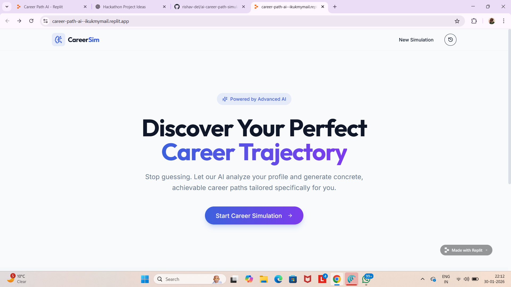
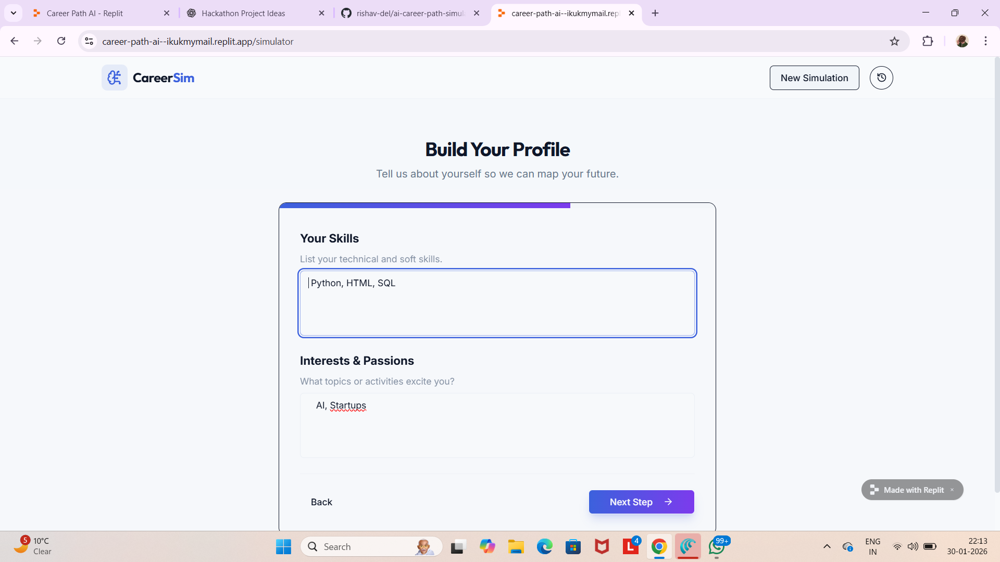
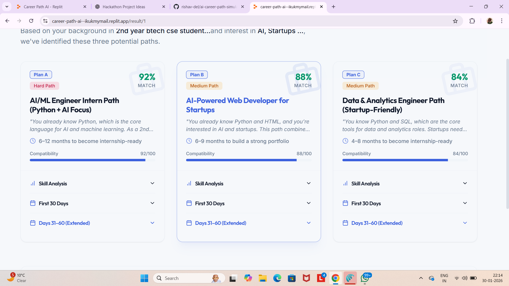
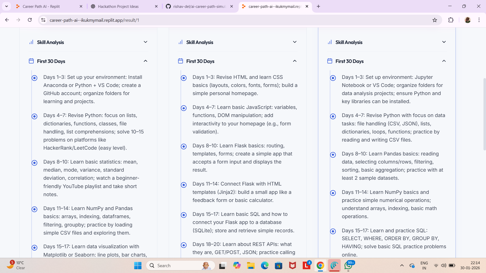

# 🎯 AI Career Path Simulator

An AI-powered web application designed to help students and early professionals discover the most suitable career paths based on their **skills, interests, and time availability** — without relying on resumes.

🌐 **Live Demo**  
https://career-path-ai--ikukmymail.replit.app  

📦 **GitHub Repository**  
https://github.com/rishav-del/ai-career-path-simulator  

---

## ❓ Problem Statement

Many students struggle to choose the right career path due to:
- Lack of structured guidance
- Overdependence on trends and peer opinions
- No clear short-term learning roadmap

This often results in confusion, wasted effort, and slow career growth.

---

## 💡 Proposed Solution

**AI Career Path Simulator** analyzes user inputs such as:
- Current background & skills  
- Personal interests  
- Weekly learning availability  

Using this data, the system generates:
- **3 personalized career paths (Plan A, B, C)**
- Compatibility score for each path
- Skill gap analysis
- **30-day actionable learning plan**
- **Extended 60-day roadmap (Days 31–60)**

The focus is on **decision-making and execution**, not resume screening.

---

## ✨ Key Features

- 🔍 AI-based personalized career recommendations  
- 📊 Compatibility scoring for each career option  
- 🧠 Skill analysis and gap identification  
- 📅 30-day + 60-day structured action plans  
- 🎨 Clean, modern AI-focused user interface  
- ⚡ Beginner-friendly and fast  

---

## 🖼️ Screenshots

### 🔹 Home Page


### 🔹 Profile Input Form


### 🔹 Career Path Results


### 🔹 30 & 60 Day Action Plan


---

## 🛠️ Tech Stack

- **Frontend:** HTML, CSS, JavaScript  
- **Logic:** Prompt-based AI simulation  
- **Deployment:** Replit  
- **Version Control:** Git & GitHub  

---

## 🧪 Example Use Case

**Input**
- Skills: Python, HTML, SQL  
- Interests: AI, Startups  
- Weekly Availability: 8 hours  

**Output**
- Beginner AI & Data Science Developer  
- Full-Stack Web Developer (Startup-focused)  
- Competitive Programming Foundations  

Each option includes a detailed roadmap and learning plan.

---

## 🚀 How to Run Locally

```bash
git clone https://github.com/rishav-del/ai-career-path-simulator.git
cd ai-career-path-simulator
```

Open `index.html` in a browser  
(or use Live Server in VS Code)

---

## 🔮 Future Enhancements

- Integration with real AI APIs (OpenAI / Gemini)
- User authentication & saved history
- Downloadable PDF career roadmap
- Progress tracking dashboard
- Mobile responsiveness improvements

---

## 👨‍💻 Author

**Rishav Kumar Gupta**  
B.Tech CSE (Cloud Computing)  
SRM University, Ghaziabad (Modinagar Campus)

---

## ⭐ Conclusion

This project demonstrates how AI-driven logic and clean UI design can help students make informed career decisions with actionable roadmaps.
